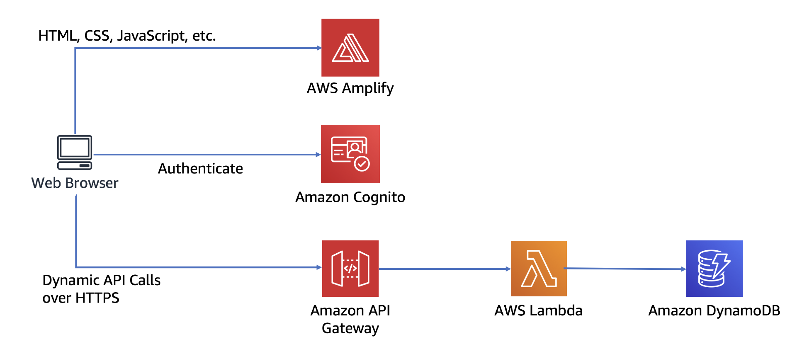

# Wild Rydes Project


----

## Overview
Welcome to the Wild Rydes project! This web application allows users to request unicorn rides from the Wild Rydes fleet. Users can specify their desired pickup location via a user-friendly HTML interface. The backend of the application communicates with a RESTful web service to handle ride requests and dispatch nearby unicorns. Additionally, the application includes features for user registration and login to facilitate ride requests.

## Architecture

The Wild Rydes application is built using the following components:

1. **Static Web Hosting**: Front-end hosted on AWS Amplify.
2. **User Management**: User authentication and management handled by Amazon Cognito.
3. **Serverless Backend**: Backend functionality provided by AWS Lambda and DynamoDB.
4. **RESTful APIs**: API interface for processing ride requests.

## Setup

### Static Web Hosting
1. **Cloud9 Environment**: Create a Cloud9 environment named `wildrydes-webapp-development`.
2. **CodeCommit Repository**: Initialize a CodeCommit repository using the AWS CLI:
    ```bash
    git clone <repository-url>
    cd <repository-directory>
    git remote add origin <codecommit-repo-url>
    git push origin master
    ```
3. **Amplify Console**: In the Amplify Console, create a new app and link it to your CodeCommit repository. Ensure that the necessary policies are attached to the role to allow backend deployment to access AWS resources.
4. **Deploy Changes**: Update the title in `index.html` within the `wild-ryes/public` directory, commit the changes, and push them to the repository. Amplify Console will automatically deploy the updates.

### User Management
1. **Install Amplify CLI**: Install the Amplify CLI in Cloud9:
    ```bash
    npm install -g @aws-amplify/cli
    ```
2. **Configure AWS Profile**:
    ```bash
    echo '[profile default]' > ~/.aws/config
    ```
3. **Initialize Amplify**:
    ```bash
    amplify init
    ```
4. **Add Auth (Amazon Cognito)**:
    ```bash
    amplify add auth
    ```
    Use the default configuration and set users to sign in using a username.
5. **Push Changes**:
    ```bash
    amplify push
    ```

### Serverless Backend
1. **Create DynamoDB Table**: Create a DynamoDB table named `Rides` with a partition key `RideID`.
2. **IAM Role for Lambda**: Create an IAM role with permissions to write to CloudWatch logs and put items in DynamoDB.
3. **Lambda Function**: Create a Lambda function named `RequestUnicorn` to process API requests and write data to DynamoDB.

### RESTful APIs
1. **Create API**: Create an API named `WildRydes` with a regional endpoint.
2. **Cognito User Pool Authorizer**: Configure a new Cognito user pool authorizer for the API.
3. **API Resources and Methods**:
    - Create a resource `/ride`.
    - Add a POST method using Lambda proxy integration backed by the `RequestUnicorn` function.
4. **Deploy API**:
    - Create a new stage named `prod`.
    - Update the `src/config.js` file with the API endpoint and push changes to redeploy via the Amplify Console.

## Deployment

To deploy the application:

1. Make necessary changes to the code.
2. Commit and push changes to the repository.
3. AWS Amplify will automatically detect changes, build, and deploy the updated application.

## Summary

The Wild Rydes project demonstrates the integration of various AWS services to build a scalable and maintainable web application. It includes static web hosting, user authentication, a serverless backend, and RESTful APIs, showcasing a modern approach to web application development.
